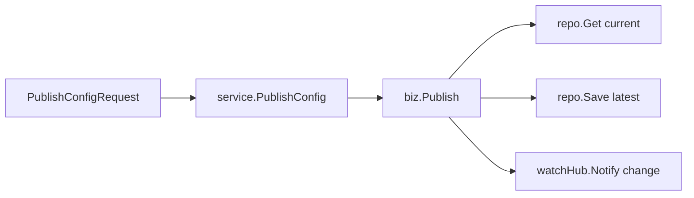

# Config Round 1 设计文档（Kratos 版）

## 1. 设计目标

把 `Nacos Config publish` 的最小闭环，映射成当前 `Kratos` 仓库里的第一版可实现模型。

这一轮不是机械复制 Java 工程结构，而是尽量保留这些精华：

- 发布与监听唤醒职责分离
- 通过轻量变更事实传播变化
- 始终以“最新快照”作为后续链路事实来源
- 查询接口与监听接口分离
- 只有内容真正变化时才唤醒监听者

## 2. 当前仓库分层

### `api`

- 维护 proto contract
- 通过 `google.api.http` 暴露 HTTP 路径
- 不写业务规则

### `service`

- 类似 `Nacos controller`
- 只负责 request/response 与 biz 的转换
- 不直接做 `md5` 计算，不直接操作 repo

### `biz`

- 放核心业务规则
- 定义领域对象
- 定义 repo / watch hub 接口
- 实现 `Publish / Get / Listen`

### `data`

- repo / cache / in-memory 实现
- 当前 round-1 先用内存版最新快照和最小 watch hub

### `server`

- 注册 HTTP / gRPC server

## 3. Round 1 的等价语义

### 3.1 `publish-first`

当前轮只要求先稳定这条语义链：

1. `PublishConfigRequest`
2. `service.PublishConfig(...)`
3. `biz.Publish(...)`
4. `data.ConfigRepo.Save(...)`
5. `data.ConfigWatchHub.Notify(...)`

对应图：



### 3.2 当前允许的简化

可以简化：

- 不拆 `DumpService / DumpProcessor / DumpConfigHandler`
- 不做异步任务队列
- 不做磁盘 cache / 本地文件快照

但不应该丢掉：

- save-first
- lightweight change
- query/listen separation

## 4. 核心模型

放在 `internal/biz/config.go`：

```go
type ConfigKey struct {
    Namespace string
    Group     string
    DataID    string
}

type ConfigItem struct {
    Key       ConfigKey
    Content   string
    MD5       string
    CreatedAt time.Time
    UpdatedAt time.Time
}

type ConfigChange struct {
    Key       ConfigKey
    MD5       string
    ChangedAt time.Time
}
```

## 5. 关键接口

### 5.1 `biz.ConfigRepo`

```go
type ConfigRepo interface {
    Save(context.Context, *ConfigItem) error
    Get(context.Context, ConfigKey) (ConfigItem, error)
}
```

### 5.2 `biz.ConfigWatchHub`

```go
type ConfigWatchHub interface {
    Notify(context.Context, *ConfigChange)
}
```

当前先不暴露完整 `Wait(...)`，等 `listen` 阶段再补。

## 6. Publish 规则

`biz.Publish(...)` 应该做：

1. 查当前最新快照
2. 计算新内容 `md5`
3. 组装新的 `ConfigItem`
4. 先保存最新快照
5. 只有在 `md5` 真变化时才 `Notify`
6. 返回新的快照

当前实现位置：

- `internal/biz/config.go`

## 7. Proto Contract

当前对外 contract：

- `api/configcenter/v1/config_center.proto`

Round 1 先定义：

```proto
rpc PublishConfig (PublishConfigRequest) returns (PublishConfigResponse) {
  option (google.api.http) = {
    post: "/v1/configs"
    body: "*"
  };
}
```

这里的 `PublishConfigRequest/Response` 是 proto message，不走旧 Gin 时代的 `Req/Resp` DTO 包。

## 8. 当前状态

当前已经完成：

- `Publish` biz 逻辑
- `PublishConfig` proto contract
- `service` 到 `biz` 的映射
- `data` 层内存实现
- `wire` 注入与 HTTP / gRPC 注册

下一步：

- 补齐 `Task 6` 的真实 HTTP transport 验证
- 然后进入 `get/listen`
