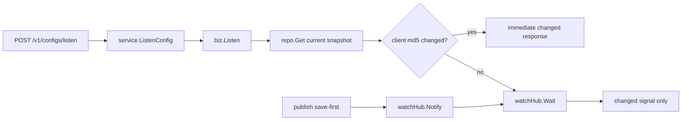

# Config Round 2 设计文档（Kratos 版）

## 1. 设计目标

把 `Nacos Config get / listen` 的最小闭环，映射成当前 `Kratos` 仓库里的第二版可实现模型。

这一轮不是把上游 `Java` 类一一照抄，而是尽量保留这些语义：

- `get` 返回完整最新快照
- `listen` 只负责变更感知
- `listen` 先比较 `md5`，没变化才等待
- 配置变化时，先让服务端最新快照可读，再唤醒等待者
- `publish / get / listen` 共享同一份最新快照事实来源

## 2. 当前仓库分层

### `api`

- 维护 proto contract
- 通过 `google.api.http` 暴露 HTTP 路径
- 不写业务规则

### `service`

- 类似上游入口层
- 只负责 request/response 与 biz 的转换
- 不直接做 `md5` 比较
- 不直接维护等待集合

### `biz`

- 放核心规则
- 定义领域对象和接口
- 实现 `Get / Listen`
- 决定“立刻返回还是等待”

### `data`

- 实现 repo / watch hub
- 维护最新快照
- 维护最小等待集合
- 负责按 key 唤醒和超时清理

### `server`

- 注册 HTTP / gRPC server

## 3. Round 2 的等价语义

### 3.1 `get`

当前轮要求保留这条语义链：

1. `GetConfigRequest`
2. `service.GetConfig(...)`
3. `biz.Get(...)`
4. `repo.Get latest snapshot`
5. 返回完整内容与当前 `md5`


### 3.2 `listen`

当前轮要求保留这条语义链：

1. `ListenConfigRequest`
2. `service.ListenConfig(...)`
3. `biz.Listen(...)`
4. 先 `repo.Get current snapshot`
5. 比较客户端 `md5`
6. 有变化则立即返回
7. 无变化则 `watchHub.Wait(...)`
8. `publish` 触发 `watchHub.Notify(...)`
9. 被唤醒后只返回变更信号



### 3.3 当前允许的简化

可以简化：

- 不复刻 `Listening-Configs` 的旧协议格式
- 不单独拆 `DumpService / DumpProcessor / DumpConfigHandler`
- 不先做 `gRPC push`
- 不先做批量 key 监听

但不应该丢掉：

- latest snapshot
- query / listen separation
- save-first
- immediate md5 compare
- per-key wait set

## 4. 核心模型

继续放在 `internal/biz/config.go`：

```go
type ConfigKey struct {
    Namespace string
    Group     string
    DataID    string
}

type ConfigItem struct {
    Key       ConfigKey
    Content   string
    MD5       string
    CreatedAt time.Time
    UpdatedAt time.Time
}

type ConfigChange struct {
    Key       ConfigKey
    MD5       string
    ChangedAt time.Time
}

type ListenResult struct {
    Key     ConfigKey
    MD5     string
    Changed bool
}
```

设计意图：

- `Get` 返回 `ConfigItem`
- `Listen` 返回 `ListenResult`
- `ListenResult` 只表达“是否发生了变化”和“当前应答的 md5”
- 不在 `listen` 响应里塞完整配置正文

## 5. 关键接口

### 5.1 `biz.ConfigRepo`

```go
type ConfigRepo interface {
    Save(context.Context, *ConfigItem) error
    Get(context.Context, ConfigKey) (ConfigItem, error)
}
```

当前 round-2 不要求新增历史版本接口。

### 5.2 `biz.ConfigWatchHub`

```go
type ConfigWatchHub interface {
    Notify(context.Context, *ConfigChange)
    Wait(context.Context, ConfigKey, time.Duration) (ConfigChange, bool, error)
}
```

设计意图：

- `biz` 先做一次 `md5` 比较
- 只有“当前快照和客户端 `md5` 一致”时，才调用 `Wait(...)`
- `Wait(...)` 只关心“这个 key 后面有没有变化”，不承担完整内容查询职责

## 6. `Get` 规则

`biz.Get(...)` 应该做：

1. 调用 `repo.Get(...)`
2. 返回当前最新快照
3. 不在 `service` 层做补充业务判断

当前实现位置：

- `internal/biz/config.go`

## 7. `Listen` 规则

`biz.Listen(...)` 应该做：

1. 查当前最新快照
2. 比较客户端传来的 `md5`
3. 如果不同，立即返回 `changed = true`
4. 如果相同，调用 `watchHub.Wait(...)`
5. 超时则返回 `changed = false`
6. 被唤醒则返回 `changed = true`
7. 返回时只带 key 和 `md5`，不带正文

这里要特别保留上游的两个精华：

- `listen` 不返回完整内容
- `listen` 唤醒后，客户端仍然要再调 `Get`

## 8. Proto Contract

当前对外 contract 建议扩成：

- `api/configcenter/v1/config_center.proto`

Round 2 建议新增：

```proto
rpc GetConfig (GetConfigRequest) returns (GetConfigResponse) {
  option (google.api.http) = {
    get: "/v1/configs"
  };
}

rpc ListenConfig (ListenConfigRequest) returns (ListenConfigResponse) {
  option (google.api.http) = {
    post: "/v1/configs/listen"
    body: "*"
  };
}
```

对应 message 建议最小化：

```proto
message GetConfigRequest {
  string namespace = 1;
  string group = 2;
  string data_id = 3;
}

message GetConfigResponse {
  string namespace = 1;
  string group = 2;
  string data_id = 3;
  string content = 4;
  string md5 = 5;
}

message ListenConfigRequest {
  string namespace = 1;
  string group = 2;
  string data_id = 3;
  string md5 = 4;
  int64 timeout_ms = 5;
}

message ListenConfigResponse {
  string namespace = 1;
  string group = 2;
  string data_id = 3;
  string md5 = 4;
  bool changed = 5;
}
```

这里和上游不完全一样的地方是：

- 上游旧 `HTTP listen` 用 `Listening-Configs`
- 当前 `mini-nacos` round-2 用 proto request 直接表达 `key + md5 + timeout`

这属于“传输简化”，不属于“语义偏离”。

## 9. 测试建议

当前 `get/listen` 建议分三层验证：

1. `internal/biz/config_test.go`
   - `Get` 命中快照
   - `Get` not found
   - `Listen` 立即返回
   - `Listen` 等待并被 `Notify`
   - `Listen` 超时
2. `internal/service/configcenter_test.go`
   - `GetConfig` request/response 映射
   - `ListenConfig` request/response 映射
3. `internal/server/http_test.go`
   - `GET /v1/configs`
   - `POST /v1/configs/listen`

## 10. 当前状态

当前 round-2 目标还未开始编码，先完成这些文档：

- `docs/study/01-config-get-listen.md`
- `docs/design/01-config-round-2.md`
- `docs/homework/01-config-round-2.md`

下一步：

- 先补 proto contract
- 再补 `biz.Listen(...)`
- 再补 data 层等待集合
