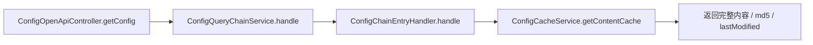
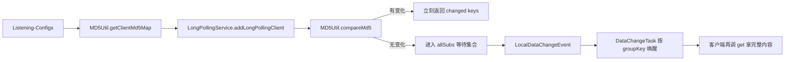
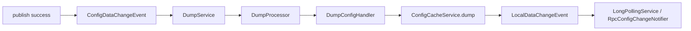

# Config Get / Listen 链路笔记

## 1. 这一条链路要解决什么问题

`publish` 讲的是“怎么把变化落成服务端事实”。

`get / listen` 讲的是另外两件事：

- 客户端怎么拿到完整最新配置
- 客户端怎么低成本感知“这份配置变了”

这一章真正要抓住的不是接口名字，而是下面 4 个设计点：

- 服务端要维护“当前可服务的最新快照”
- `get` 返回完整内容
- `listen` 只负责变更感知
- `listen` 唤醒前，服务端最新快照必须已经就绪

## 2. 先纠正一个源码事实

当前 `Nacos` 上游里，`get` 和 `listen` 不是完全同一套传输方式：

- `v3 client open api` 支持 `get`
- 旧 `1.x` 客户端还保留 `HTTP long polling`
- `2.x+` 客户端主路线已经是 `gRPC` 监听 / 推送

也就是说：

- 学 `get`，可以直接看 `ConfigOpenApiController`
- 学 `listen` 的核心语义，可以先看老的 `LongPollingService`
- 但要知道，上游当前真正的现代监听链路还包含 `gRPC push`

这一点非常重要，不然会把“老 HTTP 监听实现”误当成“当前唯一实现”。

## 3. 先看哪些源码

建议按这个顺序看：

1. `ConfigOpenApiController.getConfig(...)`
2. `ConfigQueryChainService.handle(...)`
3. `ConfigChainEntryHandler.handle(...)`
4. `ConfigServletInner.doPollingConfig(...)`
5. `MD5Util.getClientMd5Map(...)`
6. `NacosMd5Comparator.compareMd5(...)`
7. `LongPollingService.addLongPollingClient(...)`
8. `LongPollingService.DataChangeTask.run(...)`
9. `ConfigOperationService.publishConfig(...)`
10. `DumpService.handleConfigDataChange(...)`
11. `DumpProcessor.process(...)`
12. `DumpConfigHandler.configDump(...)`
13. `ConfigCacheService.dump(...)`
14. `RpcConfigChangeNotifier.onEvent(...)`

## 4. `Get` 主链

### 4.1 上游主调用链

`get` 可以先压成下面 4 步：

1. 收请求
2. 组装查询请求对象
3. 走查询责任链
4. 从当前节点本地快照返回完整内容

### 4.2 读图重点

- `get` 不是“每次直查数据库”
- 当前节点对外服务时，优先依赖本地最新快照
- 这份快照既服务 `get`，也服务 `listen` 的 `md5` 比对

## 5. `Listen` 主链

### 5.1 旧 HTTP long polling 主链

旧 `HTTP listen` 可以先压成下面 7 步：

1. 客户端带上 `(dataId, group, tenant, md5)` 列表
2. 服务端解析成 `groupKey -> clientMd5`
3. 先与当前本地快照做一次 `md5` 比对
4. 有变化，立刻返回变更 key
5. 没变化，进入等待集合
6. 本地快照变化后，命中等待集合并唤醒
7. 客户端再用查询接口拿完整内容

### 5.2 这条链最关键的结论

1. `listen` 不直接返回完整配置正文
2. `listen` 先比较 `md5`，不是先挂起
3. 等待集合按 `groupKey` 命中，不是全量广播
4. 被唤醒后，客户端还是要重新查一次完整配置

## 6. 为什么 `publish` 后不能直接唤醒监听者

`listen` 唤醒之前，上游还会走一圈：

1. `publish` 成功
2. 发 `ConfigDataChangeEvent`
3. `DumpService` 消费事件
4. `DumpProcessor` 再从持久层查最新配置
5. `DumpConfigHandler` 写入 `ConfigCacheService`
6. 只有本地快照真的更新后，才发 `LocalDataChangeEvent`
7. `LongPollingService` / `RpcConfigChangeNotifier` 再通知监听侧

读图重点：

- 入口请求体不是后续链路的最终事实来源
- 后续链路必须以“已经落稳的最新快照”为准
- 监听被唤醒时，当前节点应该已经能对外提供这份最新快照

## 7. `2.x+` 监听补充

如果只看 `LongPollingService`，会漏掉一个事实：

- 旧 `1.x` 客户端靠 `allSubs` 这类等待集合
- `2.x+` 客户端会把监听关系放到 `ConfigChangeListenContext`
- 本地配置变化后，由 `RpcConfigChangeNotifier` 给命中的连接推 `ConfigChangeNotifyRequest`

所以从“语义”上看，上游真正稳定保留的是：

- 服务端维护监听关系
- 配置变化后按 key 命中
- 通知侧只告诉客户端“变了”
- 完整正文仍由查询链拿

## 8. 当前 Kratos 仓库里的等价映射

### 上游 `get`

当前等价层：

- `internal/service/configcenter.go`
- `internal/biz/config.go`
- `internal/data/configcenter.go`

当前要保留的语义：

- `Get` 读最新快照
- 返回完整内容和当前 `md5`

### 上游 `listen`

当前等价层：

- `internal/biz/config.go`
- `internal/data/configcenter.go`

当前要保留的语义：

- 先比 `md5`
- 无变化才等待
- 配置变化时只返回变更信号
- 客户端再 `Get`

## 9. 当前允许简化什么

当前 `mini-nacos` round-2 可以不原样复刻这些东西：

- `Listening-Configs` 这套旧 HTTP 传输格式
- `ConfigQueryChainService` 的整条责任链
- `DumpService / DumpProcessor / DumpConfigHandler` 的完整拆分类
- `gRPC push` 的完整连接管理

但不应该丢掉的精华是：

- `get` 返回完整内容
- `listen` 只感知变更
- `listen` 先比 `md5`
- `save-first`
- 唤醒前最新快照已经可读
- 等待集合按 key 命中并支持超时清理

## 10. 这一轮的测试边界

当前 `get/listen` 建议分三层验证：

1. `internal/biz/config_test.go`
   - 验证 `Get`
   - 验证 `Listen` 立即返回
   - 验证 `Listen` 等待后被唤醒
   - 验证 `Listen` 超时
2. `internal/service/configcenter_test.go`
   - 验证 `GetConfig / ListenConfig` 的 request/response 映射
3. `internal/server/http_test.go`
   - 验证 `GET /v1/configs`
   - 验证 `POST /v1/configs/listen`

## 11. 复盘问题

完成这条链路后，你至少应该能回答：

1. 为什么 `get` 和 `listen` 都围着“最新快照”转，而不是每次都直查数据库？
2. 为什么 `listen` 先比 `md5`，而不是每次都进入等待集合？
3. 为什么 `listen` 不直接返回完整配置内容？
4. 为什么 `publish` 后还要经过“更新本地快照”这一步，才能唤醒监听者？
5. 当前 `mini-nacos` 为什么可以先不复刻 `DumpService`，但不能丢掉它背后的语义？
