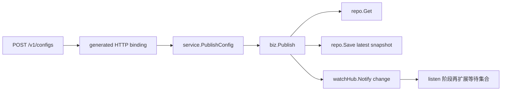

# Config Publish 链路笔记

## 1. 这一条链路要解决什么问题

`publish` 不只是“把新内容写进数据库”，而是要完成一整个闭环：

- 接收客户端发布请求
- 落成最新配置快照
- 传播轻量变更事实
- 在内容真正变化时触发监听侧后续动作

所以 `publish` 的关键不是“能不能写库”，而是：

- 写库后谁负责后续传播
- 为什么事件里只传轻量元数据
- 为什么只有 `md5` 真变化才通知下游

## 2. 先看哪些源码

建议按这个顺序看：

1. `ConfigControllerV3.publishConfig(...)`
2. `ConfigOperationService.publishConfig(...)`
3. `ConfigChangePublisher.notifyConfigChange(...)`
4. `DumpService.handleConfigDataChange(...)`
5. `DumpProcessor.process(...)`
6. `DumpConfigHandler.configDump(...)`
7. `ConfigCacheService.dump(...)`
8. `LongPollingService.DataChangeTask.run(...)`

## 3. Nacos 主调用链

普通配置发布的主链可以先压成下面 8 步：

1. 收请求
2. 写持久化层
3. 发 `ConfigDataChangeEvent`
4. 调度 dump
5. 再查最新快照
6. 刷本地 cache
7. 发本地变更事件
8. 唤醒命中监听者

### 3.1 上游调用链图

读图重点：

- `publish` 不是“一次写库后结束”，而是“写最新状态 + 驱动后续链路”
- 后半段链路消费的是“配置变更事实”，不是入口请求体本身
- `listen` 被唤醒之前，本地最新快照应该已经准备好

## 4. 这条链的关键结论

1. `publish` 先写库，不是先改监听队列
2. 传播的是“变更事实”，不是“完整内容广播”
3. 后续链路必须基于最新快照，而不是入口请求体
4. 监听被唤醒时拿到的是“哪些 key 变了”，不是完整配置内容
5. 只有 `md5` 真变化，才应该继续通知下游

## 5. 当前 Kratos 仓库里的等价映射

### 上游 `ConfigControllerV3`

当前等价层：

- `internal/service/configcenter.go`

职责：

- 接收 `PublishConfigRequest`
- 转换成 `biz.ConfigKey`
- 调用 `biz.ConfigUsecase.Publish(...)`
- 转换回 `PublishConfigResponse`

### 上游 `ConfigOperationService`

当前等价层：

- `internal/biz/config.go`

职责：

- 查询当前最新快照
- 计算新 `md5`
- 组装新的 `ConfigItem`
- 先 `Save`
- 再按 `md5` 是否变化决定是否 `Notify`

### 5.1 当前 Kratos 调用链图

这一版虽然没有把 `DumpService` 单独拆出来，但保留了两个最关键的学习点：

- `Save` 和 `Notify` 是两个职责，不要揉成一个大函数副作用
- 当前通知只传播 `ConfigChange`，不给下游塞完整内容

### 上游轻量事件传播

当前等价层：

- `biz.ConfigChange`
- `biz.ConfigWatchHub`
- `internal/data/configcenter.go`

当前还是单进程最小版，没有拆出 `DumpService / DumpProcessor`，但保留了最关键的语义：

- 不传完整配置内容
- 传播的是轻量变更元数据

### 对外入口

当前 proto contract：

- `api/configcenter/v1/config_center.proto`

当前 HTTP 路径：

- `POST /v1/configs`

## 6. 当前简化了什么

当前仓库没有原样复刻这些层：

- `DumpService`
- `DumpProcessor`
- `DumpConfigHandler`
- `ConfigCacheService`

这是允许的工程简化。

但当前没有丢掉的精华是：

- 先保存最新状态
- 再传播轻量变更事实
- 同内容重复发布不惊动监听链路

## 7. 这一轮的测试边界

当前 `publish-first` 建议分三层验证：

1. `internal/biz/config_test.go`
   - 验证 `save-first`
   - 验证 `md5` 变化判断
   - 验证“同内容不通知”
2. `internal/service/configcenter_test.go`
   - 验证 proto request/response 映射
3. `Task 6`
   - 再补真实 `POST /v1/configs` 的 HTTP transport 验证
   - 确认生成路由和 `server` 注册都接通

## 8. 复盘问题

完成这条链路后，你至少应该能回答：

1. 为什么 `publish` 不直接把完整配置推给客户端？
2. 为什么异步或后续链路必须以“最新快照”为准？
3. 为什么 `save-first` 比“先通知再保存”更合理？
4. 当前 Kratos 版 `service/biz/data` 各自对应 Nacos 主链的哪一层？
